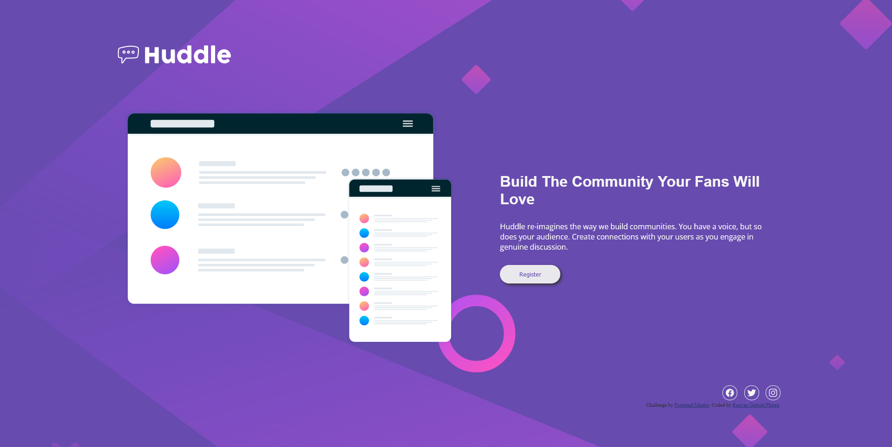

# Frontend Mentor - Huddle landing page with single introductory section solution

This is a solution to the [Huddle landing page with single introductory section challenge on Frontend Mentor](https://www.frontendmentor.io/challenges/huddle-landing-page-with-a-single-introductory-section-B_2Wvxgi0). Frontend Mentor challenges help you improve your coding skills by building realistic projects.

## Table of contents

- [Overview](#overview)
  - [The challenge](#the-challenge)
  - [Screenshots](#screenshots)
  - [Links](#links)
- [My process](#my-process)
  - [Built with](#built-with)
  - [Useful resources](#useful-resources)
- [Author](#author)

## Overview

### The challenge

Users should be able to:

- View the optimal layout for the page depending on their device's screen size
- See hover states for all interactive elements on the page

### Screenshots

 

### Links

- [Live Site URL](https://rgp-huddle-landing-page.netlify.app/)

## My process

### Built with

- Semantic HTML5 markup
- CSS custom properties
- SCSS
- Flexbox
- Responsive design
- [Open source icons](https://ionic.io/ionicons) - used for icons

### Useful resources

- [Netlify](https://www.netlify.com/)

## Author

- Frontend Mentor - [@RazvanGP](https://www.frontendmentor.io/profile/RazvanGP)
